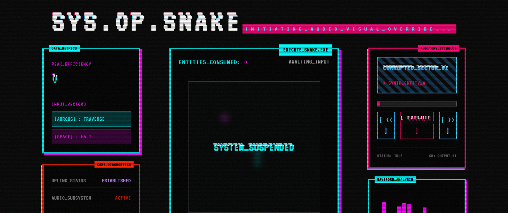

# ＳＹＳ．ＯＰ．ＳＮＡＫＥ // ＴＥＲＭＩＮＡＬ＿０５

> **WARNING: MEMORY_LEAK DETECTED. AUDIO_VISUAL_OVERRIDE INITIATED.**

```text
=========================================================
||                                                     ||
||    [ INITIALIZING_NEURAL_LINK... ]                  ||
||    [ LOADING_CRT_EMULATION... ]                     ||
||    [ INJECTING_CYAN_MAGENTA_ARTIFACTS... ]          ||
||    [ SYSTEM_READY ]                                 ||
||                                                     ||
=========================================================
```

## [ SYSTEM_OVERVIEW ]
A corrupted terminal interface merging classic entity consumption protocols (SNAKE) with a neural-linked auditory subsystem (MUSIC PLAYER). Designed with a strict Glitch Art / Retro-Futurist aesthetic. 

## [ CORE_FEATURES ]
* **`EXECUTE_SNAKE.EXE`**: Fully functional grid-traversal entity consumption simulation.
* **`NEURAL_AUDIO`**: Integrated music player featuring 3 corrupted synth-wave tracks (`CORRUPTED_SECTOR_01`, `BUFFER_OVERFLOW`, `NULL_POINTER_EXCEPTION`).
* **`CRT_EMULATION`**: Persistent scanlines and static noise overlays.
* **`CHROMATIC_ABERRATION`**: CSS-driven glitch animations and RGB-split text rendering (Cyan/Magenta).
* **`DATA_METRICS`**: Real-time peak efficiency (High Score) tracking.

## [ VISUAL_TELEMETRY ]
> **CAPTURING_SCREEN_STATE...**


*CAPTION: PRIMARY_EXECUTION_ENVIRONMENT*

## [ INPUT_VECTORS ]
* `[ ^ ] [ v ] [ < ] [ > ]` : TRAVERSE_GRID
* `[ SPACE ]`               : HALT_EXECUTION / RESUME

## [ BOOT_SEQUENCE ]
To initialize the environment locally, execute the following commands in your terminal:

```bash
> npm install
> npm run dev
```

## [ SYSTEM_COMPONENTS ]
* **FRAMEWORK**: React 19 + Vite
* **STYLING**: Tailwind CSS (v4) + Custom CSS Glitch Animations
* **TYPOGRAPHY**: VT323 (Monospace)
* **AESTHETIC**: Raw Text Brackets, High Contrast (Cyan `#00ffff` / Magenta `#ff00ff`), CSS Screen Tearing.

---
*END_OF_LINE // TERMINAL_05*
